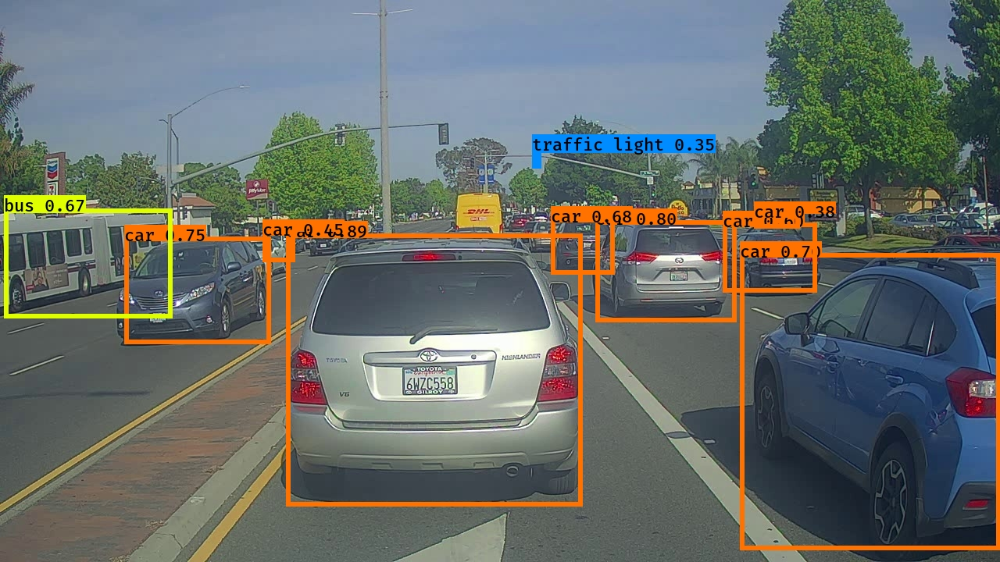
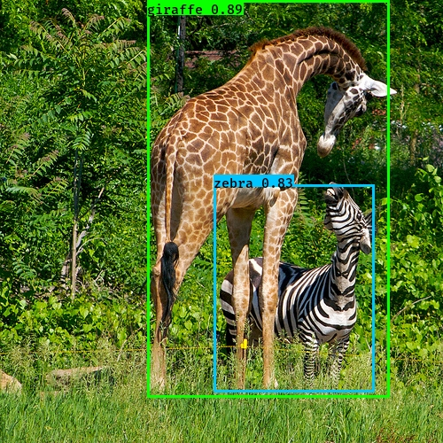
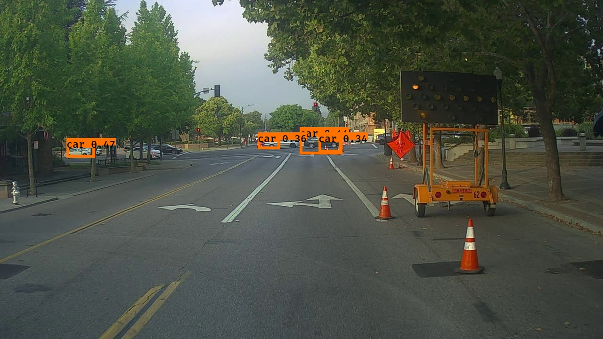
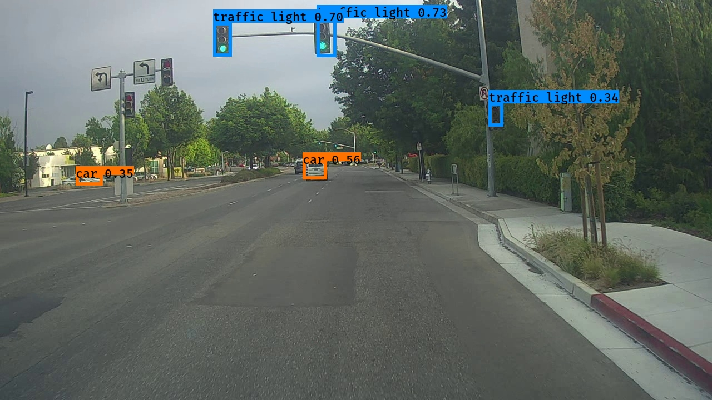

# YOLO Object Detection for Autonomous Driving


An end-to-end implementation of the **YOLO (You Only Look Once)** object detection algorithm for autonomous driving scenarios using **TensorFlow**. This project demonstrates the complete inference pipeline, including image preprocessing, confidence filtering, Intersection over Union (IoU), Non-Maximum Suppression (NMS), and visualization of detected objects.

The repository has been modernized and reorganized into a portfolio-ready project while maintaining compatibility with recent TensorFlow and Python environments.

> **Acknowledgement:** The core implementation is based on exercises from the **DeepLearning.AI Deep Learning Specialization** and has been refactored, documented, and updated for portfolio purposes.

---

# 📷 Demo Results

<p align="center">
  
  
</p>

<p align="center">
  
  
</p>

**Sample predictions generated using the pretrained YOLO model.**

---

# ✨ Features

- 🚗 YOLO-based object detection
- 📦 Confidence score filtering
- 🧠 Intersection over Union (IoU)
- 🎯 Non-Maximum Suppression (NMS)
- 🖼️ Image preprocessing and visualization
- ⚡ TensorFlow inference pipeline
- 📊 Bounding box rendering
- 🔄 Compatible with modern TensorFlow/Keras environments

---

# 📂 Repository Structure

```text
yolo-object-detection
│
├── assets/                         # Images used in the README
├── font/                           # Fonts used for visualization
├── images/                         # Sample input images
├── model_data/                     # Model configuration files
├── outputs/                        # Prediction results
├── yad2k/                          # YOLO implementation
│
├── YOLO_Object_Detection_Portfolio.ipynb
├── requirements.txt
├── README.md
├── LICENSE
└── .gitignore
```

---

# 🛠 Technologies

- Python
- TensorFlow / Keras
- NumPy
- OpenCV
- Pillow
- Matplotlib
- Jupyter Notebook

---

# 🚀 Object Detection Pipeline

The inference pipeline follows the standard YOLO workflow.

```text
Input Image
      │
      ▼
Image Preprocessing
      │
      ▼
YOLO Forward Pass
      │
      ▼
Confidence Thresholding
      │
      ▼
Intersection over Union (IoU)
      │
      ▼
Non-Maximum Suppression (NMS)
      │
      ▼
Bounding Box Visualization
      │
      ▼
Detected Objects
```

---

# ⚙️ Installation

## Clone the repository

```bash
git clone https://github.com/Sah-Pranav/yolo-object-detection.git

cd yolo-object-detection
```

## Create a Conda environment

```bash
conda create -n cv-classic python=3.10

conda activate cv-classic
```

## Install dependencies

```bash
pip install -r requirements.txt
```

## Launch Jupyter Notebook

```bash
jupyter notebook
```

Open:

```text
YOLO_Object_Detection_Portfolio.ipynb
```

---

# 📦 Model Files

To keep the repository lightweight and within GitHub's file size limits, pretrained TensorFlow model files and demonstration videos are **not included**.

Before running the notebook, place the pretrained TensorFlow SavedModel files inside:

```text
model_data/
├── saved_model.pb
└── variables/
```

These files are required for inference but are excluded from version control because they exceed GitHub's file size limits.

---

# ▶️ Usage

Run the notebook or call the prediction function.

```python
out_scores, out_boxes, out_classes = predict("test.jpg")
```

Examples:

```python
predict("test.jpg")
predict("giraffe.jpg")
predict("0001.jpg")
predict("0045.jpg")
```

Prediction results are automatically saved inside:

```text
outputs/
```

---

# 📊 Sample Results

The pretrained YOLO model successfully detects multiple object categories including:

- 🚗 Cars
- 🚌 Buses
- 🚦 Traffic lights
- 🦒 Giraffes
- Additional COCO dataset classes

Example prediction images are available in the `outputs/` directory.

---

# 💡 Skills Demonstrated

- Deep Learning
- Computer Vision
- Object Detection
- TensorFlow
- Keras
- Bounding Box Regression
- Intersection over Union (IoU)
- Non-Maximum Suppression
- Image Processing
- Model Inference
- Python Development

---

# 🔮 Future Improvements

- Fine-tune YOLO on custom datasets
- Add webcam and video inference
- Compare YOLO with SSD, Faster R-CNN, DETR, and YOLOv8
- Export models to ONNX/TensorRT
- Deploy inference using FastAPI
- Evaluate model performance using mAP on benchmark datasets

---

# 📄 License and Acknowledgement

This repository builds upon educational materials from the **DeepLearning.AI Deep Learning Specialization** and the open-source **YAD2K** implementation, both distributed under the MIT License.

The repository has been:

- Updated for compatibility with modern TensorFlow, Keras, and Pillow versions
- Reorganized into a portfolio-ready project
- Improved with cleaner documentation and project structure
- Enhanced with reproducible inference examples

The original copyright notices and MIT License have been preserved in accordance with the license terms.

---

# 📚 References

- Redmon, J., Divvala, S., Girshick, R., & Farhadi. *You Only Look Once: Unified, Real-Time Object Detection*
- TensorFlow Documentation
- DeepLearning.AI Deep Learning Specialization
- YAD2K (Yet Another Darknet 2 Keras)

---

# 👨‍💻 Author

**Pranav Kumar Sah**
